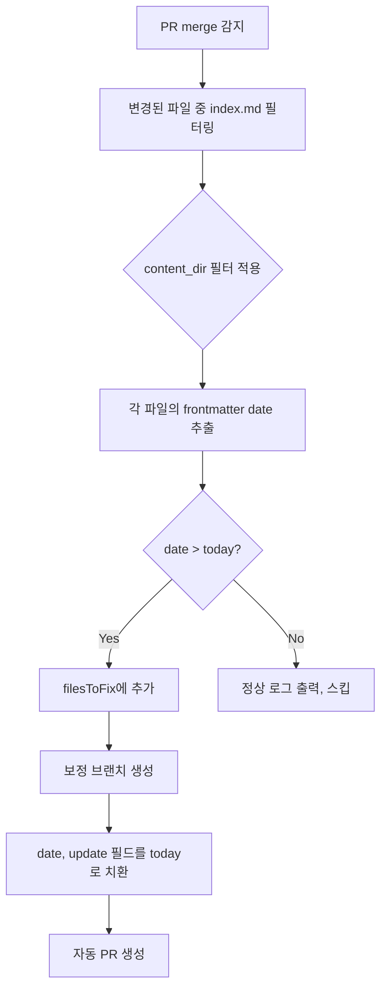

# fix-future-date.yml 개선 PRD — 과거 날짜 보정 기능 추가

## 1. 배경

현재 `fix-future-date.yml` 워크플로우는 PR merge 시 포스팅의 `date`가 **미래**인 경우만 오늘 날짜로 보정한다.

하지만 실제 운영에서는 글을 며칠 전에 작성해두고 나중에 merge하는 경우가 많다. 이때 `date`가 과거로 남아있으면 최신글인데도 날짜가 오래된 것처럼 보이는 문제가 있다.

**개선 목표**: merge 시점에 포스팅 날짜가 **과거**인 경우에도 오늘 날짜로 보정하여 발행일 = merge일이 되도록 한다.

## 2. 현재 동작 분석

### 워크플로우 구조

```
blog-v2.advenoh.pe.kr/.github/workflows/fix-future-date.yml  (트리거)
  → actions/.github/workflows/fix-future-date.yml             (재사용 워크플로우, 실제 로직)
```

### 트리거 조건
- `pull_request` 이벤트, `types: [closed]`
- `github.event.pull_request.merged == true` 일 때만 실행

### 현재 로직 (actions 워크플로우)



### 핵심 판별 코드 (Step 2: Check and fix future dates)

```javascript
// 현재: 미래 날짜만 감지
if (dateMatch && dateMatch[1] > today) {
  filesToFix.push({ path: file.filename, oldDate: dateMatch[1] });
}
```

### 보정 대상 필드
- `date:` — 발행일
- `update:` — 수정일

## 3. 변경 요구사항

### 3.1 날짜 판별 로직 변경

**Before**: `date > today` (미래 날짜만 보정)

**After**: `date !== today` (오늘이 아닌 모든 날짜 보정 — 과거 + 미래 모두)

### 3.2 수정 대상 파일

| 변경 유형 | Before | After | 설명 |
|-----------|--------|-------|------|
| 신규 생성 | - | `actions/.github/workflows/fix-post-date.yml` | 기존 로직 + 과거 날짜 보정 추가 |
| 신규 생성 | - | `blog-v2.advenoh.pe.kr/.github/workflows/fix-post-date.yml` | 새 재사용 워크플로우 호출 |
| 삭제 | `actions/.github/workflows/fix-future-date.yml` | - | 기존 워크플로우 제거 |
| 삭제 | `blog-v2.advenoh.pe.kr/.github/workflows/fix-future-date.yml` | - | 기존 트리거 워크플로우 제거 |

### 3.3 상세 변경 사항

#### A. 날짜 비교 조건 변경 (핵심)

```javascript
// Before
if (dateMatch && dateMatch[1] > today) {

// After
if (dateMatch && dateMatch[1] !== today) {
```

#### B. 로그 메시지 개선

```javascript
// Before
console.log(`미래 날짜 감지: ${file.filename} (date: ${dateMatch[1]})`);

// After — 과거/미래 구분 로그
if (dateMatch[1] > today) {
  console.log(`미래 날짜 감지: ${file.filename} (date: ${dateMatch[1]})`);
} else {
  console.log(`과거 날짜 감지: ${file.filename} (date: ${dateMatch[1]})`);
}
```

#### C. 브랜치명 및 PR 제목 변경

```javascript
// Before
const branchName = `chore/fix-future-date-${prNumber}`;
title: '[chore] 미래 날짜를 현재 날짜로 보정'

// After
const branchName = `chore/fix-date-${prNumber}`;
title: '[chore] 포스팅 날짜를 현재 날짜로 보정'
```

#### D. PR 본문 메시지 개선

```javascript
// Before
body: `PR #${prNumber} merge 시 미래 날짜가 감지되어 자동 보정합니다.`

// After
body: `PR #${prNumber} merge 시 오늘과 다른 날짜가 감지되어 자동 보정합니다.`
```

#### E. 워크플로우 파일 이름 및 name 변경

**확정: `fix-post-date.yml`** — 기존 `fix-future-date.yml`과 네이밍 패턴이 일관되고, 목적이 직관적

```yaml
# Before
name: Fix Future Date

# After
name: Fix Post Date
```

## 4. 영향 범위

### 변경 없음 (그대로 유지)
- 트리거 조건: PR merge 시에만 실행
- 파일 필터링: `index.md` + `content_dir` 기반
- 보정 방식: `date`, `update` 필드를 오늘 날짜로 치환
- 자동 PR 생성 흐름

### 변경됨
- 보정 대상: 미래 날짜만 → 오늘이 아닌 모든 날짜
- 로그 메시지: 과거/미래 구분 표시
- 브랜치명/PR 제목: 범용적 표현으로 변경

## 5. 구현 계획

### Step 1: 새 워크플로우 파일 생성
1. `actions/.github/workflows/fix-post-date.yml` 생성
   - 기존 `fix-future-date.yml` 로직 복사
   - 날짜 비교 조건 변경 (`> today` → `!== today`)
   - 로그 메시지에 과거/미래 구분 추가
   - 브랜치명, PR 제목/본문 변경
   - 워크플로우 `name: Fix Post Date`로 변경
2. `blog-v2.advenoh.pe.kr/.github/workflows/fix-post-date.yml` 생성
   - 새 재사용 워크플로우(`fix-post-date.yml`) 호출하도록 변경
   - 워크플로우 `name: Fix Post Date`로 변경

### Step 2: 기존 워크플로우 파일 삭제
1. `actions/.github/workflows/fix-future-date.yml` 삭제
2. `blog-v2.advenoh.pe.kr/.github/workflows/fix-future-date.yml` 삭제

## 6. 테스트 시나리오

| # | 시나리오 | date 값 | 예상 결과 |
|---|---------|---------|-----------|
| 1 | 과거 날짜 포스팅 merge | 2026-03-10 | 오늘 날짜(2026-03-19)로 보정 PR 생성 |
| 2 | 미래 날짜 포스팅 merge | 2026-04-01 | 오늘 날짜로 보정 PR 생성 (기존과 동일) |
| 3 | 오늘 날짜 포스팅 merge | 2026-03-19 | 보정 불필요, 스킵 |
| 4 | 여러 파일 혼합 | 과거+미래+오늘 | 과거/미래만 보정, 오늘은 스킵 |
| 5 | index.md가 아닌 파일 | - | 필터링되어 스킵 (기존과 동일) |
